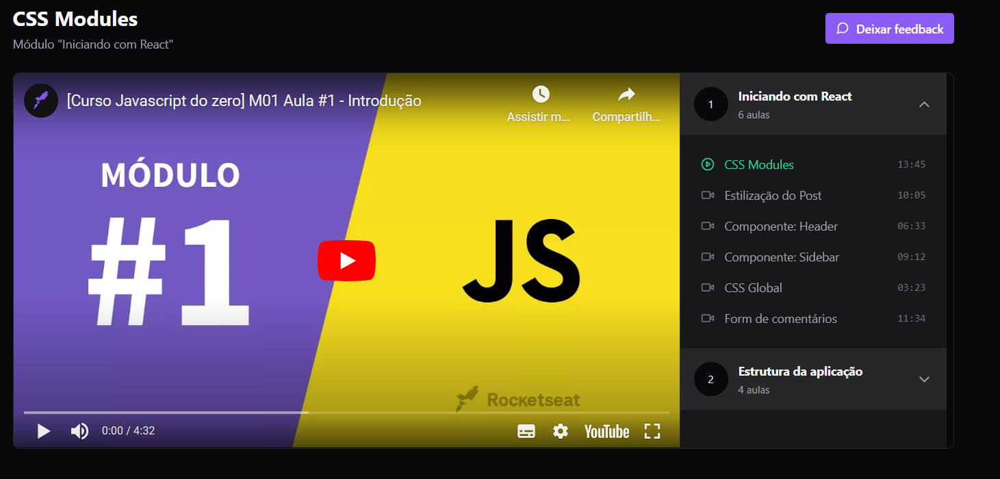

<h1 align="center"> IgNite Player de vídeo </h1>

Player de vídeo.  

  <a href="#-tecnologias">Tecnologias</a>&nbsp;&nbsp;&nbsp;|&nbsp;&nbsp;&nbsp;
  <a href="#-projeto">Projeto</a>&nbsp;&nbsp;&nbsp;|&nbsp;&nbsp;&nbsp;
  <a href="#-layout">Layout</a>&nbsp;&nbsp;&nbsp;|&nbsp;&nbsp;&nbsp;
  <a href="#memo-licença">Licença</a>

  

 

## 🚀 Tecnologias

Esse projeto foi desenvolvido com as seguintes tecnologias:

- React 
- Node
- Axios
- json-server 
- JavaScript
- Git e Github
- Figma
- api
- typescript
- teste
- redux
- reducer
- redux-toolkit
- tailwindcss
- vite
- zustand
- react-player
- vitest
- lucide-react
 